# Tatjana Marković Frontend Mentor Calculator app solution

## Table of contents

  - [Overview](#overview)
  - [The challenge](#the-challenge)
  - [Screenshot](#screenshot)
  - [Links](#links)
  - [My process](#my-process)
  - [Built with](#built-with)
  - [Author](#author)

## Overview
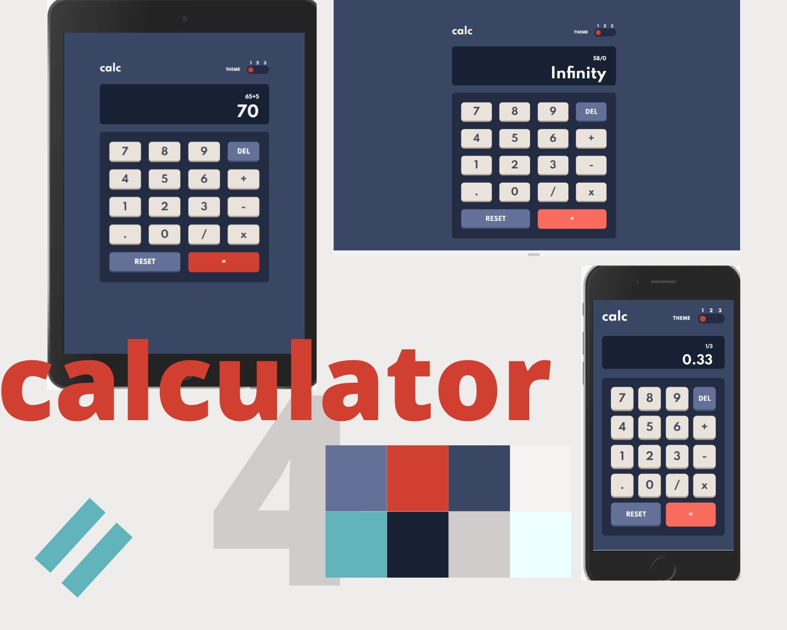
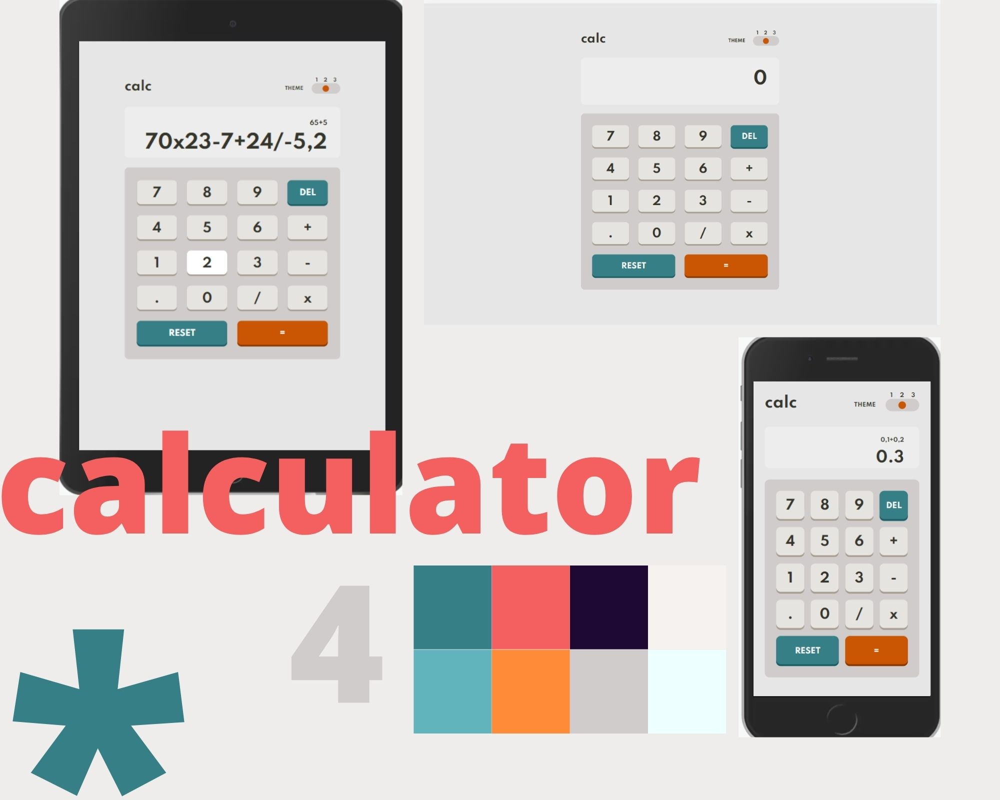
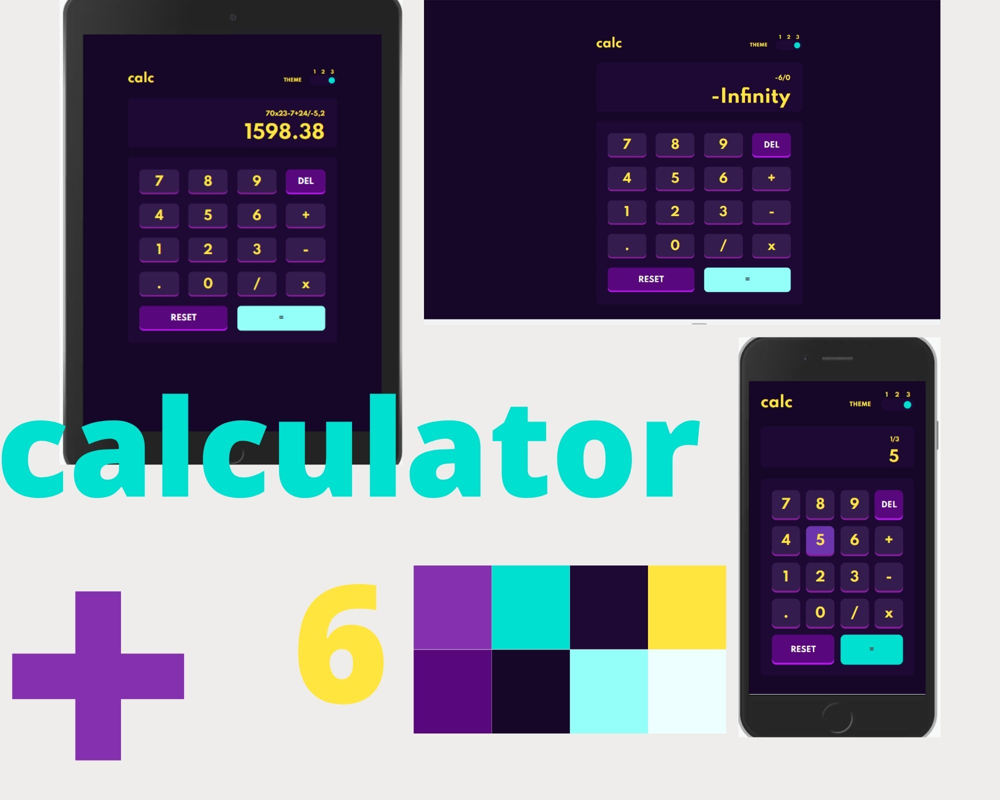
- On first load
  1. Check prefers color scheme, and apply desired color scheme.
  2. Autofocus on input field
  3. Display show "0"

- Color Theme behavior: 
  1. App have 3 Color themes and you can switch color by clicking color switcher on the right top. 
  2.When you click on Color switcher, pointer move to the position 1, 2 or 3, dependent on active   Color theme .
  3. Default Color Theme is equal as the user prefer color scheme.

- Input behavior
  1. Two ways to input values: 
      - click on button  
      - press keyboard button
  2. On the Keyboard input App allow only :
      - numbers,
      - operations +, -, *, /, 
      - dot , 
      - Enter aka "equal",
      - Backspace aka "del",
      - Delete aka "reset"
  3. During getting input value, app check whether it is valid in relation to the previously entered values. Expression Validation:
      - User cannot input two operation in the row exept two combination "/" and "-" or "*" and "-"
      - After "," must go number
      - Equal is  allowed after number, not operation or ","
      - Cannot have two "," in the same number
      - user Can remove last value as long as any value exists 

- Calculator behavior
  1. When you press "=" Result of calculations is shown on the display and expression is shown in the small screen above the display
  2. Result stay at the memory, so user can create new expression with result if next input is operation
  3. If the first pressed button  after calculation is the number, the result is remove and start new expression with that number
  4. First evaluate "/" and "*" than "-" and "+" 
  5. Result is shown with two decimal digits
  6. When user press "reset", Display show "0" and deleted expression is shown at the small screen above the display.

### The challenge

Users should be able to:

- See the size of the elements adjust based on their device's screen size
- Perform mathmatical operations like addition, subtraction, multiplication, and division
- Adjust the color theme based on their preference
- **Bonus**: Have their initial theme preference checked using `prefers-color-scheme` and have any additional changes saved in the browser

### Screenshot

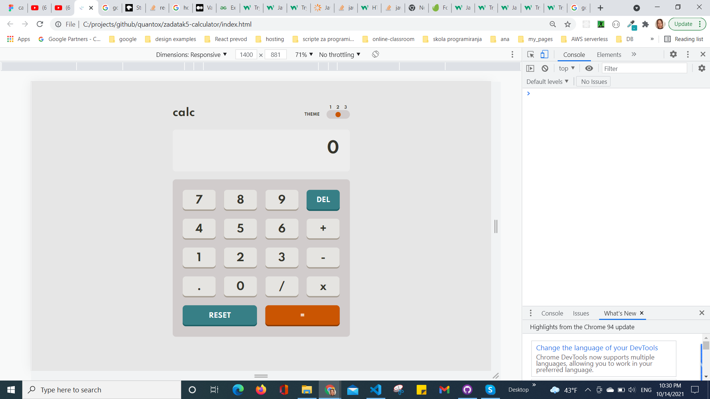
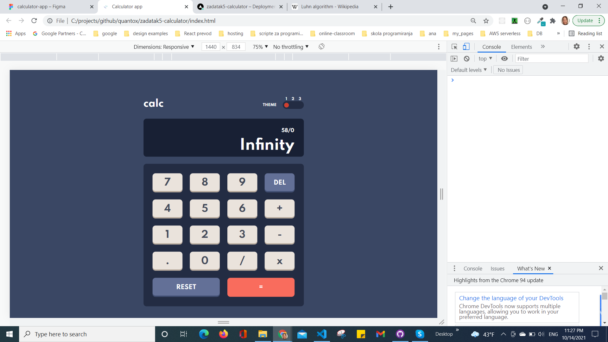
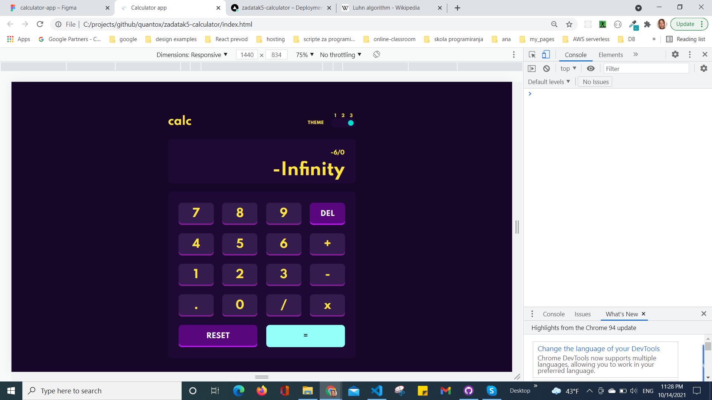
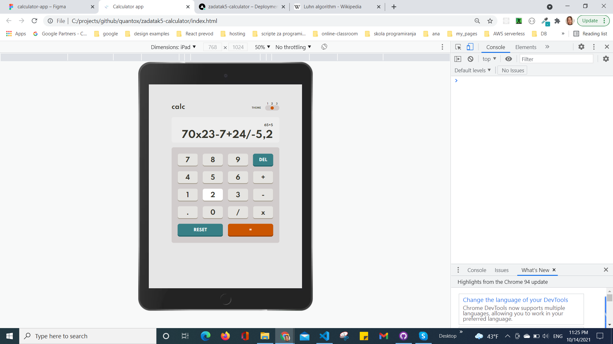
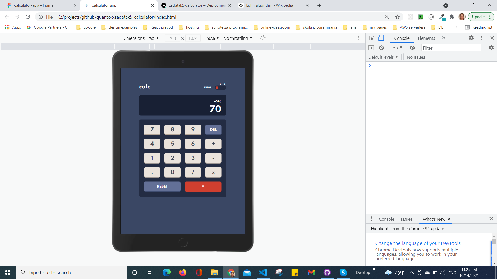
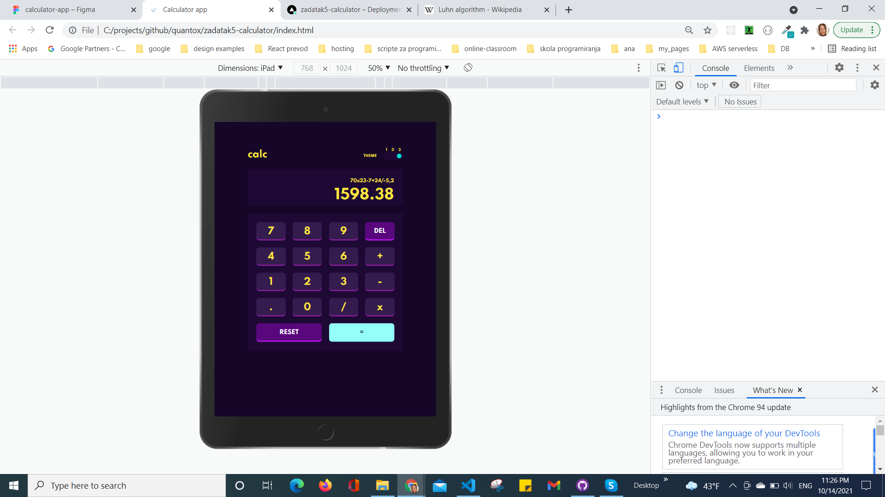
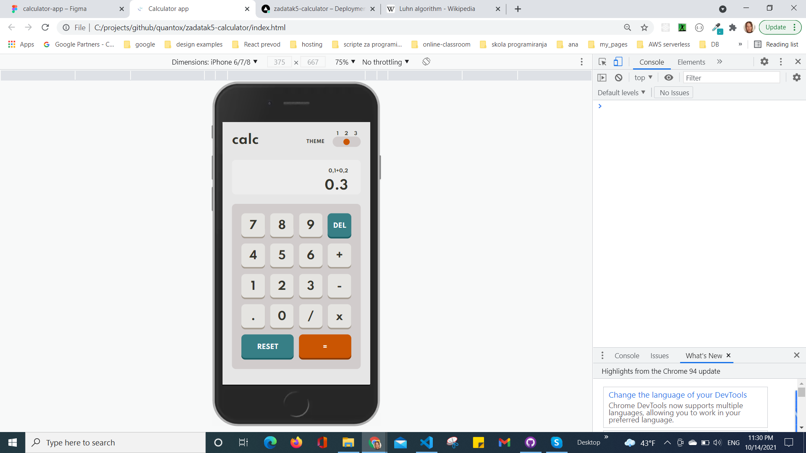
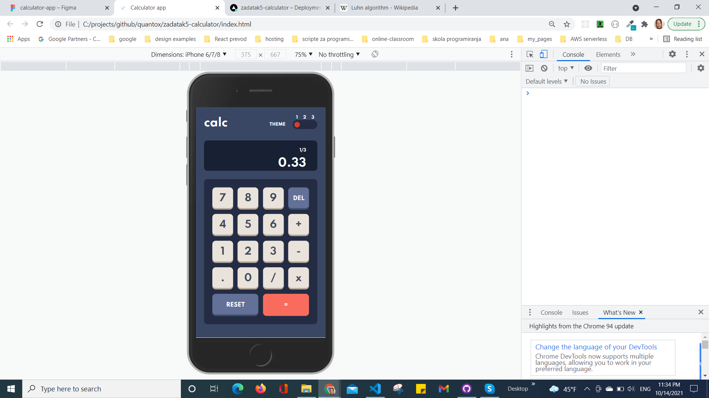
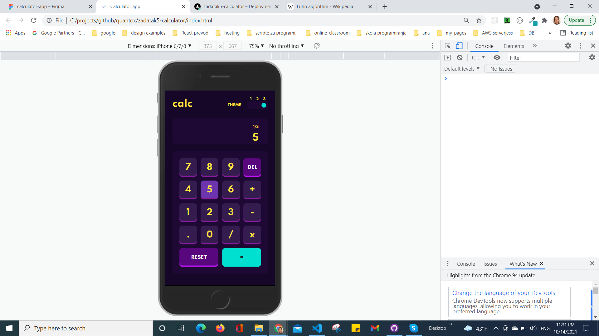

### Links

- Solution URL: [GitHub](https://github.com/tatjama/zadatak5-calculator/tree/develop)
- Preview: [Vercel](https://zadatak5-calculator-hldj0bc8i-tatjana.vercel.app/)
- Live Site URL: [Vercel](https://zadatak5-calculator.vercel.app/)

## My process

1. Create a new project
2. Import starting code
3. Initializing git repositories main and develop
4. Import git repositories to the Vercel project
5. Create HTML structure
6. Use Figma design tools for style
7. Create CSS Utility
8. Style for Desktop 
9. Responsive Mobile and Tablet style
10. Color theme manipulation with JavaScript 
11. Create Calculator logic with JavaScript
12. Allow input by Numeric Keyboard
13. Manual Test for bugs
14. Compare original designs with my work
15. Create screenshots
16. Change README-template.md to README.md
17. Open Pull request
18. Solve Issue
19. Merge develop branch into master branch
### Built with

1. Semantic HTML5 markup
2. CSS custom properties
- FlexBox
- Media queries
- Centering elements, content and text
- Element positioning
- Customize font,width and size
- Hover
- CSS variables
3. JavaScript
- DOM manipulation   
- Event handling
## Author

- Website - [Tatjana Markovic](https://my-react-portfolio-tatjana.vercel.app/)
- LinkedIn - [Tatjana Marković](https://www.linkedin.com/in/tatjana-markovi%C4%87-919501189/)
- GitHub - [tatjama](https://github.com/tatjama)

